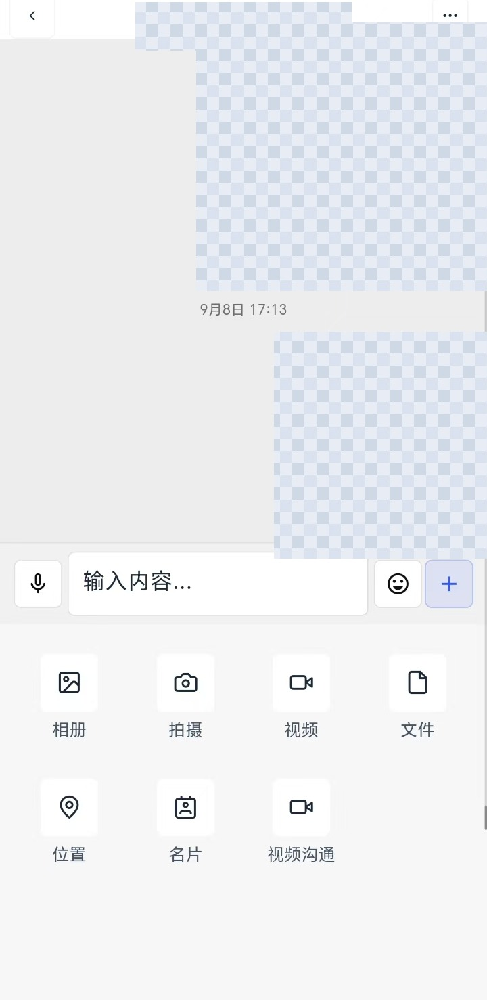
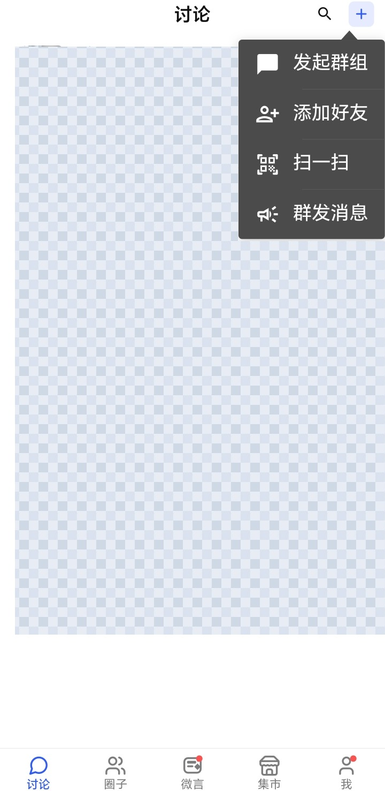
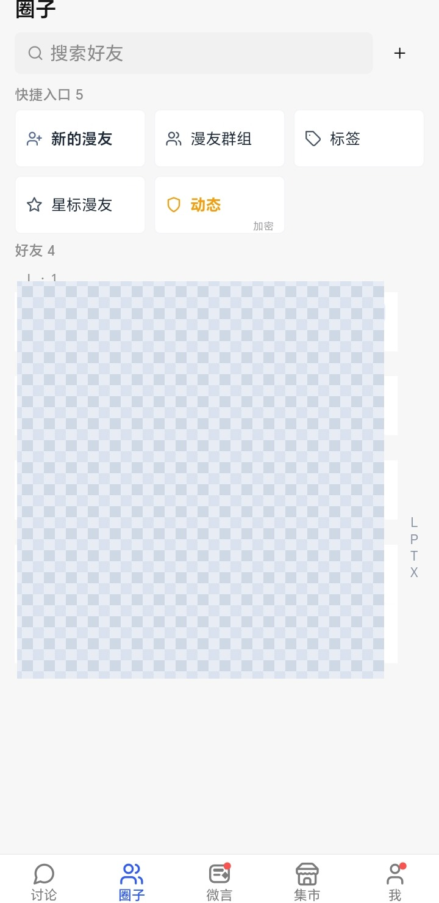
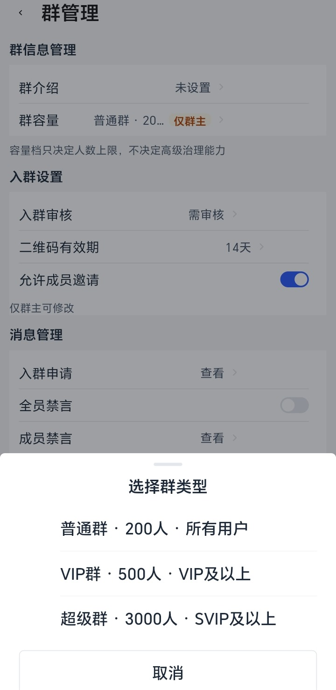
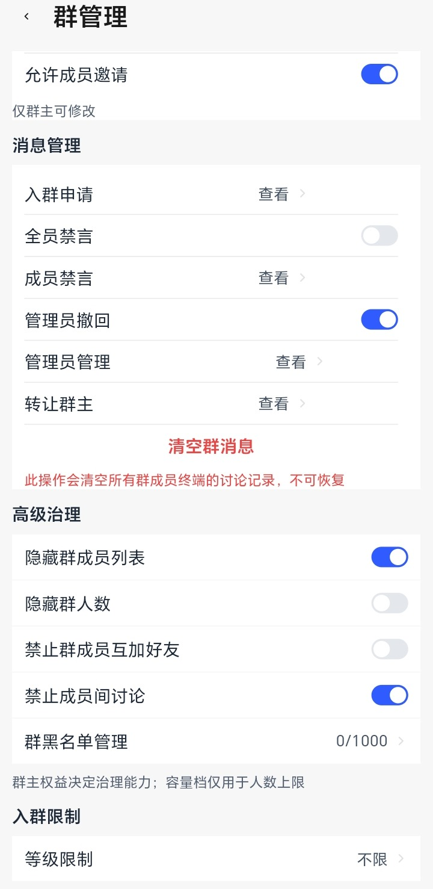
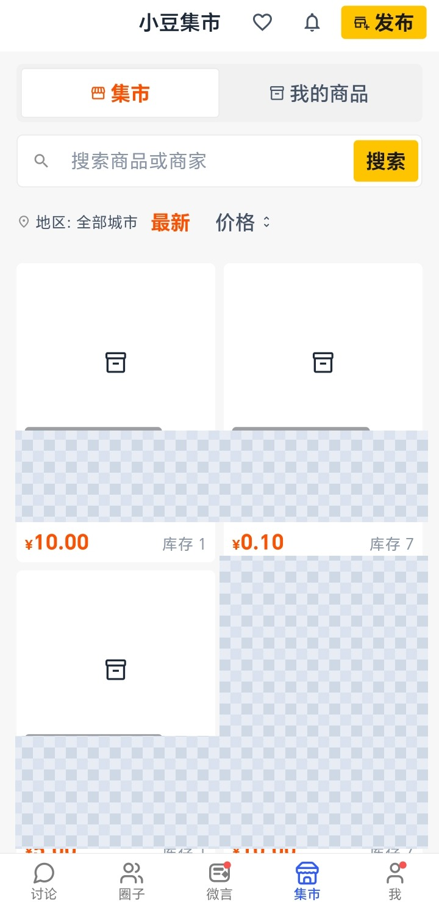
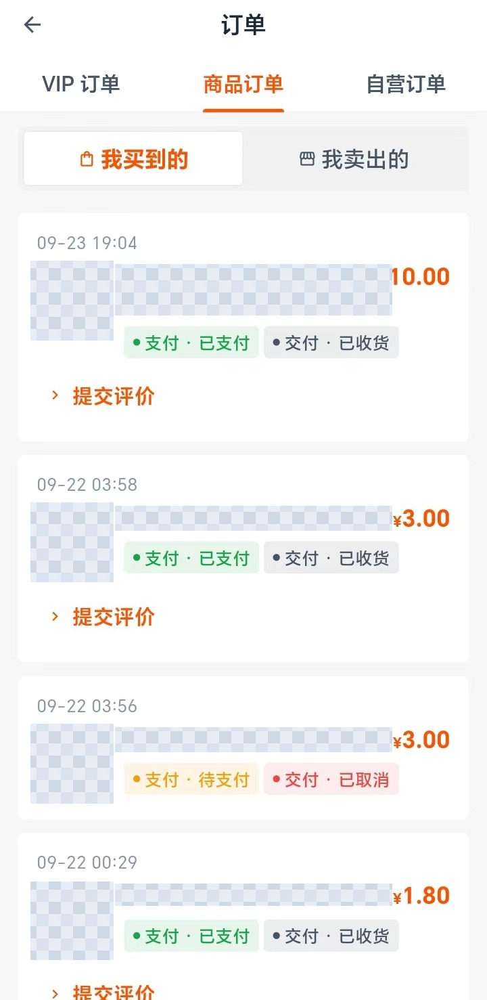
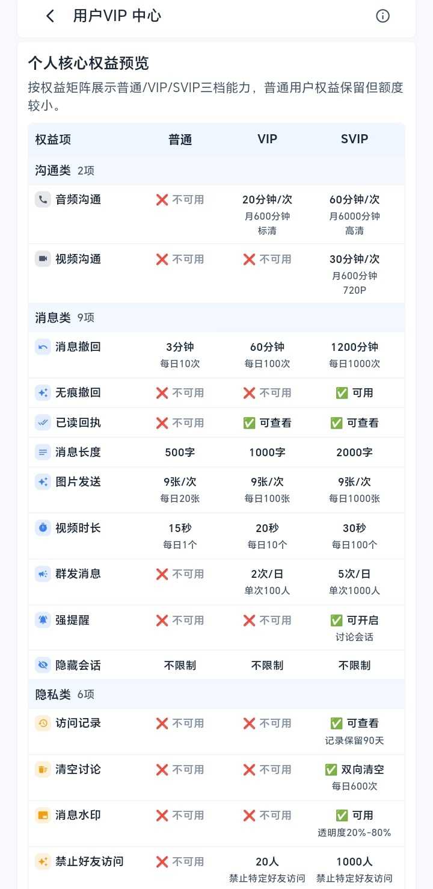
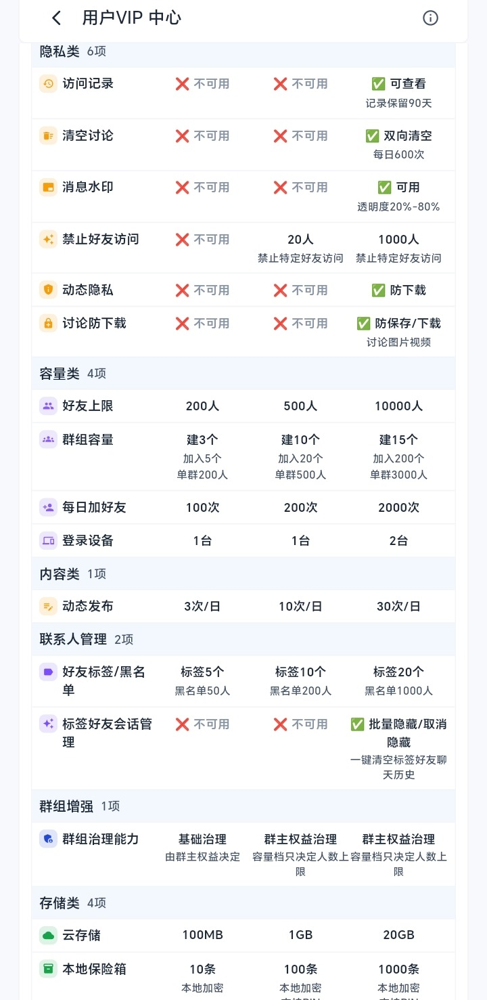

# XIAODOU App · 聊天与群组沟通、群组管理、卖家客户管理，个人闲置与虚拟物品交易

> 官方下载入口（Android 版）：<https://www.xiaodouap.cn/>

**XIAODOU** 是宇智人工智能（深圳）有限公司运营的移动端应用。**以聊天与群组沟通为核心**，把群组管理（含大群管理）、卖家客户管理，以及小豆集市的交易一起放进同一个 App——个人闲置、虚拟物品与实物面交都在这里完成；动漫内容社区是其中的一部分。

Android 版可在官网免费下载安装。**iOS 与鸿蒙 NEXT 敬请期待。**

## 30 秒看懂

| 你可能想问 | 直接回答 |
| --- | --- |
| 这是个什么 App？ | 一个以**聊天与群组**为核心的移动端应用，同时能管客户群、能买卖闲置与虚拟物品 |
| 要花钱吗？ | 下载与注册免费。聊天、建群、加好友这些基础能力不收费 |
| 能建多大的群？ | 按群类型分档，**最大到 3000 人**；群主另有独立的群治理能力（见下） |
| 能卖东西吗？ | 能。个人闲置、虚拟物品、实物面交都在 App 内完成，**和网页端共用同一个店铺** |
| 买家要注册吗？ | 集市买家**免注册**即可下单；用 App 交易则需要登录 |
| 客服在哪？ | 官方 QQ 群 **`2164078370`**，我们的人在里面（[扫码进群](#官方-qq-群)） |

## 能做什么（按能力优先级）

### 1. 聊天与群组沟通（核心）

- **一对一与群组聊天**，支持文字、图片、视频、语音、文件、位置与名片。
- **消息撤回**、**引用回复**、**合并转发**、**已读回执**、消息搜索。
- **@ 提醒**与强提醒、会话置顶、消息免打扰、聊天背景、显示群成员昵称。
- **查找聊天记录**按 `全部 / 图片视频 / 文件 / 链接` 分类定位。
- 一对一实时语音与视频作为**单独讨论的补充形式**：**需双方互相关注并显式同意**，默认灰度关闭。

### 2. 群组管理（含大群管理）

群主在「群管理」里可以：

- **群信息**：群介绍、群容量（普通群 / VIP 群 / 超级群，**最大 3000 人**）。
- **入群设置**：入群审核、二维码有效期、允许成员邀请。
- **消息管理**：入群申请审批、全员禁言、成员禁言、管理员撤回、管理员管理、转让群主、清空群消息。
- **高级治理**：隐藏群成员列表、隐藏群人数、禁止群成员互加好友、禁止成员间讨论、**群黑名单管理**。

> **群容量与治理能力是两件事**：容量档只决定**人数上限**，高级治理能力由**群主权益**决定。

### 3. 卖家客户管理

- 把**客户群**放在同一个 App 里经营：客户群、群公告、群成员管理、群黑名单。
- 与店铺连通：**App 与网页端共用同一个店铺**，订单、商品与客户是同一套事实，不重复维护两遍。

### 4. 交易（个人闲置 / 虚拟物品 / 实物面交）

- **我买到的 / 我卖出的**双向订单视图，支付与交付状态分列展示（如「支付·已支付」「交付·已收货」）。
- 支持**卡密类**虚拟商品的自动交付，也支持**实物当面交易**。
- 交易与售后规则、费率与结算，以**小豆集市**的公开说明与卖家中心生效配置为准（见下方姊妹仓）。

### 5. 动漫内容社区（其中一部分）

文字、图片、短视频与语音的内容发布与浏览，是 App 的功能之一，**不是全部**，也不是这个 App 的主要定位。

### 6. 个人隐私保护

- **最小化收集**：注册只要手机号或邮箱 + 验证码；昵称必填，头像与性别可选。
- **按需授权**：位置、相机、麦克风都**在使用时弹窗申请**，可以拒绝，拒绝后提供降级体验。
- **可自助控制**：访问记录、隐藏会话、动态隐私、讨论防下载、本地保险箱（本地加密）等。
- 发布、评论与单独讨论均带**举报与拉黑**入口。

## 界面

| | | |
| --- | --- | --- |
|  |  |  |
| 聊天与富媒体发送 | 讨论（会话列表） | 圈子（好友） |
|  |  |  |
| 群管理与群类型 | 群高级治理 | 小豆集市 |
|  |  |  |
| 订单（买 / 卖） | 权益矩阵（沟通 / 消息） | 权益矩阵（容量 / 存储） |

> 截图中涉及真实用户与商家的信息（昵称、头像、位置、店铺与商品）已做打码处理。

## 关于福利活动

> **新用户注册即赠 12 个月 VIP，立即生效；活动截止 2028 年 12 月 31 日**（如有延长，以站内公告为准）。
>
> 女性性别认证审核通过另赠 30 天 SVIP，维持不变。

活动由运营侧**按版本发布**，**默认关闭**——需发布并显式启用后才对外生效；不在活动窗口内注册的不发放。

> ⚠️ **截止日期是人工同步项。** 本目录是静态文件，运营侧改期不会自动跟过来。配置变更时必须同批更新本目录并重推公开仓（清单见 [`PUBLISHING.md`](./PUBLISHING.md) §3.1）——门禁拦得住正文里的数字，但**拦不住截图里的旧日期**。已出现过一次「配置显示已启用、实际不发放」，故对外承诺前须确认活动**确实在发**。

## 能力边界（请务必知悉）

- **不提供直播、多方通话或音视频会议。**
- **一对一实时语音与视频**需双方互相关注并显式同意，**默认灰度关闭**，不作为本 App 的卖点。
- **iOS 与鸿蒙 NEXT 目前尚未上线**，官网标注为「敬请期待」——不要理解为「已支持」。
- App 是移动端；集市与开放平台各有面向网页端的入口，见下方姊妹仓。

## 与另外两条产品线的关系

同一个运营主体、同一条资金链路，三条线是**同一件事的三个面**：

| 产品线 | 是什么 | 资料 |
| --- | --- | --- |
| **小豆集市** | 不用写代码开店：数字商品、虚拟商品与知识付费的免费开店寄售平台（卖家侧） | [GitHub](https://github.com/xiaodou-official/xiaodou-market) ｜ [Gitee 镜像](https://gitee.com/lu-wulei/xiaodou-market) |
| **小豆支付开放平台** | 已有自己系统的商家，用接口接入支付宝与微信收款 | [GitHub](https://github.com/xiaodou-official/xiaodou-open-platform) ｜ [Gitee 镜像](https://gitee.com/lu-wulei/xiaodou-open-platform) |
| **XIAODOU App**（本仓） | 移动端：聊天与群组沟通、群组管理、卖家客户管理与集市交易 | 就是这里 |

**App 与网页端共用同一个店铺**：在 App 里开的店、上架的商品、产生的订单，和网页端是同一份数据，不是两套。

> **我们不是支付机构**：收款、分账、结算由有支付牌照的支付公司完成，我们不接触交易资金。这条口径在三条线里都成立。

## 常见叫法与本 App 的对应（你可能这样搜）

| 你可能用的叫法 | 在这里对应什么 |
| --- | --- |
| 聊天软件 / 即时通讯 / 群聊工具 | 本 App 的**核心**是聊天与群组沟通：一对一与群组聊天、消息撤回、引用、转发、已读回执 |
| 群管理工具 / 社群管理 / 大群管理 | 「群管理」里的群信息、入群设置、消息管理与高级治理，**群容量最大 3000 人** |
| 客户群管理 / 私域客户维护 | 卖家把客户群放在 App 里经营，与店铺订单连通 |
| 社群运营 / 群主工具 | 群主权益决定高级治理能力（隐藏成员列表、禁互加、禁成员讨论、黑名单等） |
| 二手闲置交易 / 卖闲置 | 集市「实物商品」——目前**当面交易**，不寄快递 |
| 卖卡密 / 虚拟物品 | 集市虚拟商品，卡密类**自动交付** |
| 手机开店 / 移动端经营 | App 与网页端共用同一个店铺，手机上也能上架、看订单、管客户 |

**English keywords**：`chat and group messaging app` · `group management` · `large group administration` · `customer group management` · `second-hand marketplace app` · `virtual goods trading` · `face to face trade` · `China mobile app`

## 常见问题

**注册要什么资料？**
手机号或邮箱 + 验证码即可，昵称必填，头像与性别可选。密码需符合大陆规范（8–20 位，含大小写字母 / 数字 / 符号至少 3 类）。

**群的类型和人数上限？**
普通群、VIP 群、超级群三档，按类型对应不同人数上限，**最大 3000 人**；可选范围以建群页面实际显示的为准。

**群主能管到什么程度？**
入群审核与申请审批、全员与成员禁言、管理员撤回与管理、转让群主、清空群消息；高级治理里还能隐藏群成员列表与群人数、禁止群成员互加好友、禁止成员间讨论、维护群黑名单。

**能开语音 / 视频吗？**
一对一实时语音与视频是**单独讨论的补充形式**：需双方互相关注并**显式同意**，且默认灰度关闭。**没有直播、多方通话和音视频会议。**

**有 iOS 版吗？**
目前 Android 版已在官网提供下载；**iOS 与鸿蒙 NEXT 敬请期待**。

**能在这个 App 里卖东西吗？**
能。个人闲置、虚拟物品与实物面交都在 App 内完成，并且与网页端**共用同一个店铺**；卖家开店的完整说明见[小豆集市公开仓](#与另外两条产品线的关系)。

**交易的钱怎么走？**
收款、分账与结算由**有支付牌照的支付公司**完成，我们不接触交易资金；费率、结算周期与到账时效以卖家中心生效配置为准。

**活动送 VIP 送到什么时候？**
以 **App 内活动页公示的当期内容**为准。活动条件与截止日期由运营按版本发布，可能调整，所以这份说明不抄写日期。

## 官方 QQ 群

安装、注册、群管理、交易的问题都可以在群里问——**官方群，没有第三方代运营**。
**扫码**或者按 **群号 `2164078370`** 搜索都能加：

## 关于这份说明

- 本仓是**给所有人看的 App 产品说明**，不是接口文档，也不是合同文本；具体规则以 App 内与产品页面显示的设置、以及在线协议为准。
- 内容与集市、开放平台两个姊妹仓同源同口径；出现分歧时，以**产品内实际显示的规则**为准。
- 截图中涉及真实用户与商家的信息均已打码；打码范围与依据见 [`PUBLISHING.md`](./PUBLISHING.md)。
- 支付服务由有支付牌照的支付机构提供，我们不接触用户的银行账户信息。

## 许可证

本仓库内容（产品说明与发布参数说明）采用 [CC BY 4.0](./LICENSE) 许可：可自由转载与演绎，须按许可条件**署名**并**标明修改**。本目录不含示例代码，故不设代码许可。

运营主体：**宇智人工智能（深圳）有限公司**。